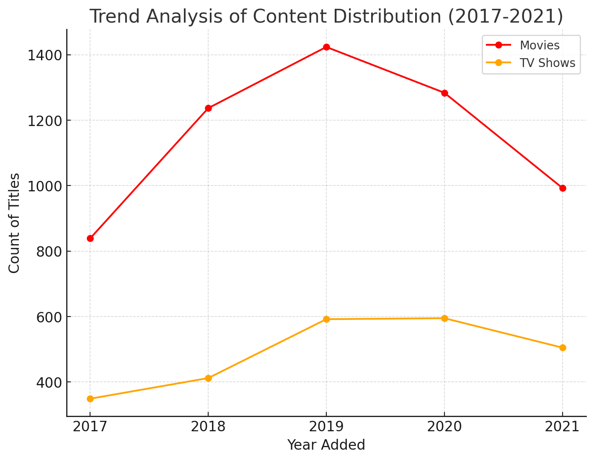
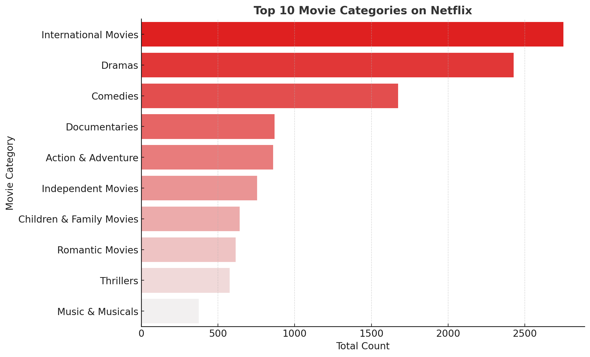
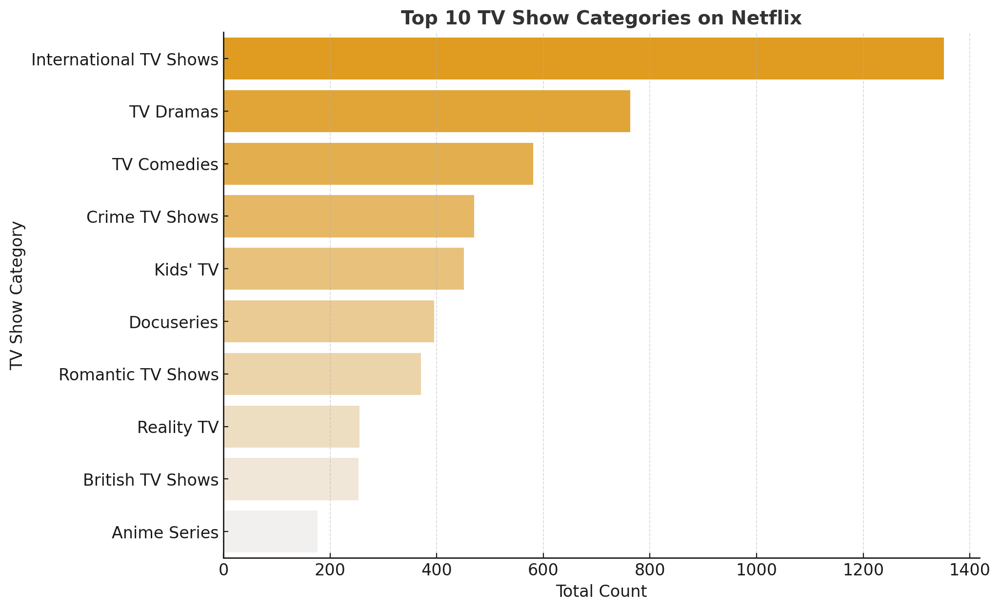
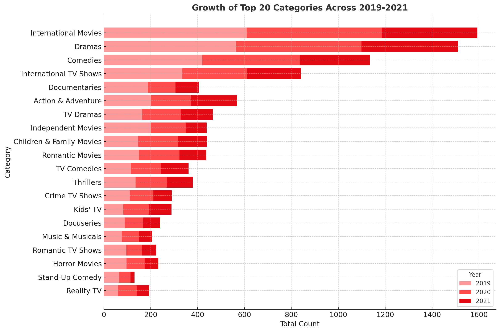
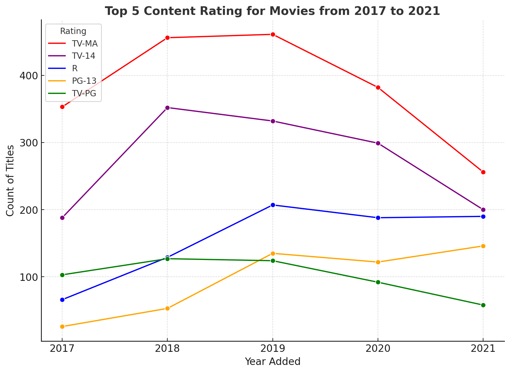
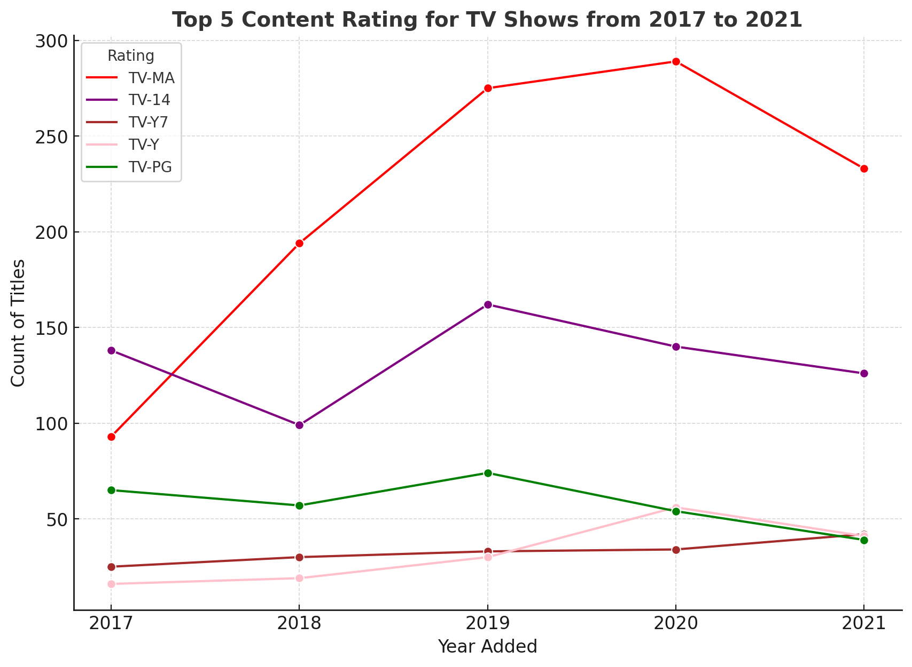
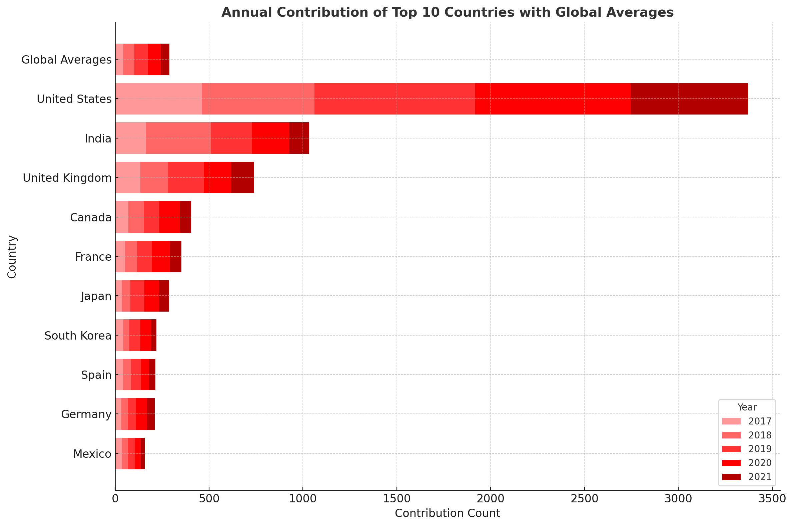

# Netflix Movies and TV Shows Data Analysis using SQL


# Introduction
Welcome to my Netflix Content Analysis Portfolio Project! This analysis dives deep into Netflix's content library, leveraging advanced SQL techniques to uncover meaningful business insights about the streaming giant's content distribution and strategy.

The project utilizes advanced SQL concepts, including **window functions**, dynamic **string manipulation**, and **aggregations** to analyze Netflix's vast content library. And utilize **CTEs and subqueries** to build layered analyses.

Through systematic data cleaning, transformation, and visualization processes, this analysis will will explore content distribution patterns, audience preferences, and regional contributions, to provide data-driven recommendations to optimize Netflix's content strategy.

# Background

Netflix, a global streaming entertainment service founded in 1997, has revolutionized how people consume media by providing on-demand access to a vast library of movies, TV shows, documentaries, and original content. With over 230 million subscribers across 190+ countries, Netflix operates in an increasingly competitive streaming landscape where content quality and variety are crucial differentiators.

This project aims to help Netflix optimize its content library through data-driven insights, focusing on three key strategic questions: 

1. **Content Diversity and Balance**
   
   How can Netflix optimize its content portfolio mix across different types and genres to maximize audience engagement and maintain market leadership?
2. **Audience-Centric Insights**
   
   How effectively is Netflix's content serving different audience segments, and what adjustments to content duration and ratings mix could enhance viewer satisfaction?
3. **Content Strategy Optimization**
   
   How can Netflix leverage geographic content distribution and key creative partnerships to strengthen its global market position and content quality?

By analyzing Netflix's extensive content database, we'll provide actionable recommendations to enhance their competitive advantage and maintain market leadership in the streaming industry.

# Methodology

## Working Data

The dataset comes from [ZeroAnalyst](https://github.com/najirh/netflix_sql_project) on GitHub and contains information on Netflix titles, including movies and TV shows, available on the platform. It includes metadata such as title, director, cast, country of origin, release year, and genre.

Link to the database: [Movies Dataset](https://www.kaggle.com/datasets/shivamb/netflix-shows?resource=download)

Link to schema: [Netflix Database Schema](/Schema.sql)

## Tools Used

- **SQL**: My primary tool for database querying and analysis, enabling complex data manipulation and extraction.

- **PostgreSQL**: Chosen database management system ideal for handling large datasets

- **Visual Studio Code**: Integrated development environment (IDE) used for writing, testing, and debugging SQL queries.

- **ChatGPT Advanced Data Analytics**: Utilized for generating data visualizations from the SQL code

- **Python**: For plotting visualizations that did not directly load from ChatGPT

- **GitHub**: Version control platform for maintaining code history and tracking project progress.

## SQL Solutions
This README documentation prioritizes showcasing business insights and key findings. For brevity, some SQL queries are abbreviated and certain query results are presented through visualizations rather than the complete tables. For a comprehensive view of all SQL queries, solutions, and complete result tables, please refer to the link below.

Full SQL Queries and Solutions: [Solution of Business Problems](/Solution%20of%20Business%20Problems.sql)

# Analysis

## Content Diversity and Balance

### <u>Total Distribution of Movies vs. TV Shows</u>
A snapshot of Netflix's content library, examining the numerical breakdown between movies and TV shows to understand the platform's overall content balance.

```sql
SELECT 
  type,
  COUNT(show_id)
FROM netflix
GROUP BY
  type;
```

| Type     | Count |
|----------|-------|
| Movie    | 6131  |
| TV Show  | 2676  |


Movies make up the majority of Netflix's catalog, accounting for 70% (6,131 titles), while TV shows represent 30% (2,676 titles).

### <u>Annual Content Trend: Movies vs. TV Shows (2017-2021)</u>
This shows the year-by-year evolution of Netflix's content additions, offering insights into how the platform has balanced its movie and TV show acquisitions over a five-year period.

```sql
SELECT 
  EXTRACT(YEAR FROM date_added) AS year_added,
  type,
  COUNT(show_id)
FROM netflix
WHERE
  EXTRACT(YEAR FROM date_added) IS NOT NULL
  AND EXTRACT(YEAR FROM date_added) > 2016
GROUP BY
  type,
  year_added
ORDER BY
  year_added DESC,
  type;
```



In 2021, both movies and TV shows experienced a significant reduction in additions, likely due to production disruptions during the COVID-19 pandemic. This raises questions about the resilience of acquisition strategies and the importance of maintaining a balanced reliance on both existing and newly produced content. Movies showed greater vulnerability, experiencing a steeper decline and higher volatility compared to TV shows.

### <u>Annual Ratio Distribution: Movies vs. TV Shows (2017-2021)</u>
This examines the proportional relationship between movies and TV shows in Netflix's annual content additions, helping to identify shifts in content strategy and acquisition priorities.

```sql
WITH annual_counts AS (
  SELECT 
    EXTRACT(YEAR FROM date_added) AS year_added,
    type,
    COUNT(show_id) AS content_count
  FROM netflix
  WHERE
    EXTRACT(YEAR FROM date_added) IS NOT NULL
    AND EXTRACT(YEAR FROM date_added) > 2016
  GROUP BY
    type,
    year_added
)

SELECT
  m.year_added,
  m.content_count as movie_counts,
  tv.content_count as tv_counts,
  ROUND((CAST(m.content_count AS NUMERIC)/tv.content_count), 2) as ratio

FROM annual_counts as m
  JOIN annual_counts as tv
  ON m.year_added = tv.year_added
WHERE
  m.type = 'Movie' AND tv.type = 'TV Show'
ORDER BY m.year_added DESC;
```

| Year Added | Movie Counts | TV Counts | Ratio |
| --- | --- | --- | --- |
| 2021 | 993 | 505 | 1.97 |
| 2020 | 1,284 | 595 | 2.16 |
| 2019 | 1,424 | 592 | 2.41 |
| 2018 | 1,237 | 412 | 3.00 |
| 2017 | 839 | 349 | 2.40 |

Netflix's ratio of Movies to TV Shows peaked in 2018 at 3:1, showing a strong preference for movies during that period. This ratio steadily decreased, dropping to approximately 1.97:1 by 2021. This shift suggests Netflix's increasing emphasis on TV shows, which often generate better viewer retention. Given the proven success of serialized content in keeping audiences engaged, Netflix is well-positioned to expand its TV show offerings. 

### <u>Top 10 Performing Categories Across Movies and TV Shows</u>
An analysis of Netflix's content categories, examining the distribution of shows and movies across different genres, categories, or lists.

```sql
WITH unnested_categories AS (
  SELECT
    UNNEST(STRING_TO_ARRAY(listed_in, ',')) AS category,
    COUNT(show_id) AS show_count
  FROM netflix
  WHERE type = 'Movie'   -- Same code as 'TV Shows'
  GROUP BY category
)

SELECT
  TRIM(category) AS top_category,
  SUM(show_count) AS total_count
FROM unnested_categories
GROUP BY top_category
ORDER BY total_count DESC
LIMIT 10;
```



```sql
WITH unnested_categories AS (
  SELECT
    UNNEST(STRING_TO_ARRAY(listed_in, ',')) AS category,
    COUNT(show_id) AS show_count
  FROM netflix
  WHERE type = 'TV Show'
  GROUP BY category
)

SELECT
  TRIM(category) AS top_category,
  SUM(show_count) AS total_count
FROM unnested_categories
GROUP BY top_category
ORDER BY total_count DESC
LIMIT 10;
```




<u>International content</u> dominates across both movies (2,752 titles) and TV shows (1,351 titles), demonstrating the effectiveness of Netflix’s global strategy. The platform’s ability to secure high-performing international titles underscores the success of its strategy. To sustain this momentum, Netflix can continue expanding <u>international partnerships</u> with distributors and producers in key markets (See Analysis: Section 3 for Key Countries).

<u>Dramas and comedies</u> consistently rank among the top categories, highlighting their universal appeal and cross-regional demand. This broad audience interest positions these two categories as cornerstones of Netflix's content strategy, making them critical areas for continued investment, especially when it comes to <u>Netflix Originals</u>.

Family-friendly content presents a growth opportunity. <u>Kids’ TV</u> (451 titles) and <u>children’s movies</u> (641 titles) provide an entry point into <u>household retention</u>, as younger viewers can drive long-term family subscriptions. And niche categories like Docuseries (395 titles) and Stand-Up Comedy (343 titles), while currently underrepresented could benefit from targeted investments to tap into loyal, <u>niche viewership</u> markets.

### Growth of Top 20 Categories Across 2019-2021
This analysis examines the distribution and trends of Netflix content across different categories for the past 3 years, providing insights into content strategy and catalog composition over time.


```sql
SELECT
  TRIM(UNNEST(STRING_TO_ARRAY(listed_in, ','))) AS category,
  SUM(CASE
    WHEN EXTRACT(YEAR FROM date_added) = '2019' THEN 1
    ELSE 0
  END) AS year_2019,
  SUM(CASE
    WHEN EXTRACT(YEAR FROM date_added) = '2020' THEN 1
    ELSE 0
  END) AS year_2020,
  SUM(CASE
    WHEN EXTRACT(YEAR FROM date_added) = '2021' THEN 1
    ELSE 0
  END) AS year_2021,
  COUNT(show_id) AS count
FROM netflix
GROUP BY category
ORDER BY count DESC
LIMIT 20;
```

| Category | 2019 | 2020 | 2021 | Total |
| --- | --- | --- | --- | --- |
| International Movies | 583 | 538 | 392 | 2624 |
| Dramas | 365 | 346 | 262 | 1600 |
| Comedies | 286 | 302 | 201 | 1210 |
| Action & Adventure | 202 | 170 | 196 | 859 |
| Documentaries | 186 | 107 | 96 | 829 |
| Dramas | 199 | 189 | 150 | 827 |
| International TV Shows | 191 | 154 | 129 | 774 |
| Independent Movies | 196 | 143 | 87 | 736 |
| TV Dramas | 155 | 147 | 124 | 696 |
| Romantic Movies | 149 | 172 | 114 | 613 |
| Children & Family Movies | 136 | 158 | 116 | 605 |
| International TV Shows | 144 | 123 | 100 | 577 |
| Thrillers | 117 | 121 | 90 | 512 |
| Comedies | 134 | 114 | 98 | 464 |
| TV Comedies | 92 | 94 | 91 | 461 |
| Crime TV Shows | 96 | 90 | 63 | 399 |
| Kids' TV | 74 | 89 | 86 | 388 |
| Music & Musicals | 77 | 68 | 56 | 357 |
| Romantic TV Shows | 90 | 60 | 49 | 338 |
| Stand-Up Comedy | 65 | 48 | 17 | 334 |



Analysis of Netflix's content library from 2019-2021 reveals clear category leaders, with <u>International Movies (2,624), Dramas (1,600), and Comedies (1,210)</u> comprising the majority of content. However, a notable decline in International Movies from 583 (2019) to 392 (2021) indicates a potential strategic shift.

Analysis of Netflix's content library reveals opportunities in <u>underserved categories</u> like Stand-Up Comedy (334 titles) and Romantic TV Shows (338 titles), while the strong performance of international content and family programming indicates areas for continued investment.
  


## Audience-Centric Insights

### <u>Top 5 Content Ratings Across Movies and TV Shows from 2017 to 2021</u>
Analysis of content rating distributions over a five-year period, revealing how Netflix balances mature, family-friendly, and age-specific content across its library.

```sql 
-- Movies
WITH top_ratings AS (
  SELECT 
    rating,
    COUNT(show_id) AS total_count
  FROM netflix
  WHERE type = 'Movie' AND rating IS NOT NULL AND rating NOT LIKE '%min%'
  GROUP BY rating
  ORDER BY total_count DESC
  LIMIT 5
),
yearly_rating_trends AS (
  SELECT 
    EXTRACT(YEAR FROM date_added) AS year_added,
    rating,
    COUNT(show_id) AS count
  FROM netflix
  WHERE 
    type = 'Movie' 
    AND EXTRACT(YEAR FROM date_added) BETWEEN 2017 AND 2021
    AND rating IS NOT NULL AND rating NOT LIKE '%min%'
  GROUP BY year_added, rating
)

SELECT 
  y.year_added,
  y.rating,
  y.count
FROM yearly_rating_trends y
JOIN top_ratings t ON y.rating = t.rating
ORDER BY y.rating, y.year_added;
```



```sql
-- TV Shows
WITH top_ratings AS (
  SELECT 
    rating,
    COUNT(show_id) AS total_count
  FROM netflix
  WHERE type = 'TV Show' AND rating IS NOT NULL AND rating NOT LIKE '%eason%'
  GROUP BY rating
  ORDER BY total_count DESC
  LIMIT 5
),
yearly_rating_trends AS (
  SELECT 
    EXTRACT(YEAR FROM date_added) AS year_added,
    rating,
    COUNT(show_id) AS count
  FROM netflix
  WHERE 
    type = 'TV Show' 
    AND EXTRACT(YEAR FROM date_added) BETWEEN 2017 AND 2021
    AND rating IS NOT NULL AND rating NOT LIKE '%eason%'
  GROUP BY year_added, rating
)

SELECT 
  y.year_added,
  y.rating,
  y.count
FROM yearly_rating_trends y
JOIN top_ratings t ON y.rating = t.rating
ORDER BY y.rating, y.year_added;
```



Analysis of Netflix's content ratings reveals a strong focus on mature content, with <u>TV-MA</u> dominating both categories: 2,062 titles for movies and 1,145 for TV shows. While TV-MA movie content peaked in 2019 before declining in 2021, TV shows grew significantly in this rating, indicating a strategic shift towards longer formats and higher user retention.

<u>TV-14</u> is the second most prevalent rating across both categories (1,427 movies, 733 TV shows), showing Netflix's strong position in the teenage demographic. While <u>child-friendly content</u> remains limited—making up less than 10% of total content—possibly due to competition from dedicated children's streaming services, it maintains a consistent presence (TV-Y and TV-Y7).

Netflix's strategic focus on <u>PG-13 movies</u> since 2019 demonstrates increased attention to the <u>tween audience</u>—viewers transitioning between childhood and adolescence. This strategy helps Netflix attract younger viewers early, allowing them to grow with the platform as they gradually move toward mature content offerings.

Based on this data, Netflix should maintain its strong position in the teenage-to-adult transition demographic while strategically expanding child-friendly content. The modest but steady growth in children's TV shows (TV-Y growing from 16 in 2017 to 41 in 2021) indicates potential for expanding this segment to create a <u>complete viewer lifecycle</u>.


### <u>Runtime Patterns and Content Duration Across Netflix Movies and TV Shows</u>
Analysis of how content duration varies across Netflix's library, showing the distribution of movie runtimes in hours and TV show lengths in seasons.


```sql
WITH new_duration AS (
  SELECT
    show_id,
    type,
    CASE
      WHEN duration LIKE '%min%' THEN CAST(TRIM(REPLACE(duration, 'min', '')) AS INT)
      WHEN duration LIKE '%Season%' THEN 
        CAST(TRIM(SUBSTRING(duration FROM 1 FOR POSITION('Season' IN duration) - 1)) AS INT)
      ELSE NULL -- Handle any other cases where duration doesn't match these patterns
    END AS clean_duration
  FROM netflix
)

SELECT
  CASE   -- Groups Movies
    WHEN clean_duration <= 60 THEN '-1 hr'
    WHEN clean_duration <= 90 THEN '1-1.5 hrs'
    WHEN clean_duration <= 120 THEN '1.5-2 hrs'
    WHEN clean_duration <= 150 THEN '2-2.5 hrs'
    WHEN clean_duration <= 180 THEN '2.5-3 hrs'
    ELSE '3+ hrs'
  END AS duration_group,
  COUNT(show_id) AS show_count
FROM new_duration
WHERE type = 'Movie'
GROUP BY duration_group
ORDER BY duration_group ASC;

-- For TV Shows, same CTE(new_duration) is used as above.

SELECT
  CASE   -- Groups TV Shows
    WHEN clean_duration <= 1 THEN '1' -- Cascading groups has been chosen to naturally align with the distribution of TV show durations. 
    WHEN clean_duration <= 3 THEN '2-3'
    WHEN clean_duration <= 6 THEN '4-6'
    WHEN clean_duration <= 10 THEN '7-10'
    WHEN clean_duration <= 17 THEN '11+'
    ELSE NULL
  END AS season_duration,
  COUNT(show_id) AS show_count
FROM new_duration
WHERE type = 'TV Show'
GROUP BY duration_group
ORDER BY show_count DESC;

```

**Movies: Distribution of Runtime**

| Duration Range | Show Count | Percentage |
|----------------|------------|------------|
| Less than 1 hour | 487 | ~6% |
| 1 - 1.5 hours | 1,503 | ~18% |
| 1.5 - 2 hours | 2,996 | ~37% |
| 2 - 2.5 hours | 897 | ~11% |
| 2.5 - 3 hours | 198 | ~2% |
| 3+ hours | 50 | ~1% |

**TV Shows: Distribution of Runtime**

| Season Range | Show Count | Percentage |
| --- | --- | --- |
| 1 season | 1,793 | ~61% |
| 2-3 seasons | 624 | ~21% |
| 4-6 seasons | 193 | ~7% |
| 7-10 seasons | 56 | ~2% |
| 11+ seasons | 10 | <1% |

Netflix's movie content analysis reveals a clear strategic pattern in content duration. The data shows that movies between <u>1.5-2 hours</u> dominate the library at 37%, with shorter 1-1.5 hour films making up 18% of content. This concentration suggests a sweet spot for viewer engagement, while longer films over 2.5 hours represent less than 5% of the catalog.

For TV shows, single-season content dominates the library at <u>61%</u>. Multi-season shows (2-3 seasons) comprise 21% of content, while longer-running series of 4+ seasons remain rare at just 10%. This distribution enables Netflix to experiment with new concepts while carefully extending successful shows.

Based on these findings, several key business strategies emerge: For movies, prioritize production in the proven 1.5-2 hour range while maintaining shorter formats for experimentation. For TV shows, maintain the high-volume single-season for testing while strengthening the pipeline for extending successful shows into medium-length series. Netflix should also strategically invest in select long-running series to create <u>flagship shows</u>—like "Stranger Things" or "The Crown"—that drive long-term viewer retention. Throughout this process, continuous monitoring of viewer engagement metrics will help optimize content duration.


### Top 10 Categories of Long Running Shows in Netflix
This reveals which genres are most successful at maintaining viewer interest across long-running TV shows (4+ seasons).

```sql
WITH long_running_shows AS (
  SELECT
    show_id,
    title,
    TRIM(LEFT(duration, 2)) AS number_of_seasons,
    listed_in
  FROM netflix
  WHERE
    type = 'TV Show' AND
    CAST(TRIM(LEFT(duration, 2)) AS INT) > 4
)

SELECT
  TRIM(UNNEST(STRING_TO_ARRAY(listed_in, ','))) AS categories,
  COUNT(show_id) AS count
FROM long_running_shows
GROUP BY
  categories
ORDER BY
  count DESC
LIMIT 20;
```

| Category | Count |
| --- | --- |
| TV Comedies | 62 |
| TV Dramas | 60 |
| International TV Shows | 33 |
| Crime TV Shows | 29 |
| Kids' TV | 24 |
| TV Action & Adventure | 22 |
| British TV Shows | 16 |
| Classic & Cult TV | 14 |
| TV Sci-Fi & Fantasy | 14 |
| Romantic TV Shows | 10 |
| TV Mysteries | 9 |
| Docuseries | 9 |
| Teen TV Shows | 8 |
| TV Horror | 8 |
| Anime Series | 6 |
| Reality TV | 6 |
| TV Thrillers | 5 |
| Stand-Up Comedy & Talk Shows | 5 |
| Spanish-Language TV Shows | 5 |
| Science & Nature TV | 1 |


Netflix's data shows a clear pattern in successful long-running shows, with <u>TV Comedies</u> and <u>TV Dramas</u> dominating at 62 and 60 shows respectively. This success suggests Netflix should maintain strong investment in comedy and drama productions, as these genres have proven their ability to sustain multiple seasons.

<u>International content</u> has become a major force with 33 long-running series. This presents growth opportunities through the other international categories like British TV shows, Japanese anime, and Spanish-language content, as well as other key markets (See Analysis: Section 3). Crime TV Shows (29) and Kids' TV (24) also form significant segments of sustained content that Netflix can build upon.

## Content Strategy Optimization

### <u>Annual Contribution (2017 to 2021) Of Top 10 Contributing Countries With Global Averages</u>
An analysis that examines where shows and movies are produced globally and how different regions contribute to the platform's offerings.


*Note: Global Averages are computed from the top 30 Contributors*

```sql
WITH countries_unnested AS (
  SELECT
    TRIM(UNNEST(STRING_TO_ARRAY(country, ','))) AS country_group,
    show_id,
    EXTRACT(YEAR FROM date_added) AS year_added
  FROM netflix
),

trend_top_30_countries AS(
  SELECT
    country_group,
    COUNT(*) FILTER(WHERE year_added = 2017) AS year_2017,
    COUNT(*) FILTER(WHERE year_added = 2018) AS year_2018,
    COUNT(*) FILTER(WHERE year_added = 2019) AS year_2019,
    COUNT(*) FILTER(WHERE year_added = 2020) AS year_2020,
    COUNT(*) FILTER(WHERE year_added = 2021) AS year_2021,
    ROUND(COUNT(*)/5.0) AS average,
    COUNT(*) AS total
  FROM countries_unnested
  GROUP BY country_group
  ORDER BY COUNT(*) DESC
  LIMIT 30
)

SELECT --- Adding Global Averages
  'Global Average' AS country_group,
  ROUND(AVG(year_2017)) AS avg_2017,
  ROUND(AVG(year_2018)) AS avg_2018,
  ROUND(AVG(year_2019)) AS avg_2019,
  ROUND(AVG(year_2020)) AS avg_2020,
  ROUND(AVG(year_2021)) AS avg_2021,
  ROUND(AVG(average)) AS avg_per_year,
  ROUND(SUM(total) / 30.0) AS avg_total
FROM trend_top_30_countries

UNION ALL

SELECT *
FROM trend_top_30_countries
LIMIT 10;
```



| Country Group | 2017 | 2018 | 2019 | 2020 | 2021 | Avg Per Year | Total |
|--------------|------|------|------|------|------|--------------|-------|
| Global Average | 43 | 60 | 71 | 69 | 46 | 62 | 311 |
| United States | 462 | 600 | 856 | 828 | 627 | 738 | 3690 |
| India | 162 | 349 | 218 | 199 | 105 | 209 | 1046 |
| United Kingdom | 134 | 147 | 191 | 146 | 120 | 161 | 806 |
| Canada | 71 | 81 | 84 | 110 | 59 | 89 | 445 |
| France | 53 | 64 | 79 | 97 | 60 | 79 | 393 |
| Japan | 37 | 44 | 74 | 79 | 53 | 64 | 318 |
| Spain | 42 | 43 | 53 | 43 | 33 | 46 | 232 |
| South Korea | 43 | 33 | 59 | 56 | 29 | 46 | 231 |
| Germany | 33 | 34 | 45 | 58 | 40 | 45 | 226 |


Netflix's global content production landscape reveals significant market concentration and emerging opportunities. The <u>United States</u> maintains a dominant position with 3,690 titles, while India and the United Kingdom follow with 1,046 and 806 titles respectively. 

This data suggests two key strategic directions. First, there's a clear opportunity to reduce market dependency by diversifying content sources, particularly given the strong presence of <u>Asian markets</u> in the top 10 content producing countries. Second, while <u>European conten</u>> shows robust representation through multiple countries contributing over 1,600 titles collectively, there's potential for growth by expanding partnerships beyond current top contributors. Mexico is also an underutilized market, producing only 31 titles annually, suggesting an opportunity for investment and growth in the Latin American region or <u>Spanish-speaking countries</u> in general.


### <u>Director Analysis: Netflix Content Contributors (All-Time vs. 2021)</u>
Compares historical and recent (2021) data of Netflix's most prolific directors to identify top contributors or high-volume content creators.

```sql
-- All-Time vs 2021
SELECT
  UNNEST(STRING_TO_ARRAY(director, ',')) AS top_directors,
  COUNT(show_id) AS total_count,
  COUNT(CASE
    WHEN EXTRACT(YEAR FROM date_added) = '2021' THEN 1
    ELSE NULL
  END) AS count_2021
FROM netflix
GROUP BY top_directors
ORDER BY total_count DESC
LIMIT 30;
```
**Director's Total Show Contributions vs 2021 Contributions**
| Director | Total Count | Count 2021 |
| --- | --- | --- |
| Rajiv Chilaka | 22 | 17 |
| Jan Suter | 18 | 0 |
| Raúl Campos | 18 | 0 |
| Suhas Kadav | 16 | 15 |
| Marcus Raboy | 16 | 0 |
| Jay Karas | 15 | 0 |
| Cathy Garcia-Molina | 13 | 0 |
| Jay Chapman | 12 | 0 |
| Martin Scorsese | 12 | 3 |
| Youssef Chahine | 12 | 1 |
| Steven Spielberg | 11 | 3 |
| Don Michael Paul | 10 | 3 |
| David Dhawan | 9 | 1 |
| Shannon Hartman | 9 | 0 |
| Yılmaz Erdoğan | 9 | 2 |
| Quentin Tarantino | 8 | 1 |
| Fernando Ayllón | 8 | 1 |
| Johnnie To | 8 | 0 |
| Ryan Polito | 8 | 0 |
| Troy Miller | 8 | 2 |
| Lance Bangs | 8 | 0 |
| Robert Rodriguez | 8 | 1 |
| Hanung Bramantyo | 8 | 2 |
| Kunle Afolayan | 8 | 0 |
| Hakan Algül | 8 | 2 |
| Prakash Satam | 7 | 2 |
| Omoni Oboli | 7 | 0 |
| Mae Czarina Cruz | 7 | 2 |
| Anurag Kashyap | 7 | 0 |
| Lasse Hallström | 7 | 5 |

The Netflix director analysis reveals a strategic mix of both prolific content creators and prestigious filmmakers. <u>Rajiv Chilaka</u> stands out as the most productive director with 22 total titles and 17 titles in 2021 alone, while established directors like <u>Scorsese, Spielberg, and Tarantino</u> maintain significant presence. The platform's 2021 lineup showed increased focus on Asian content creators, with directors like Hidenori Inoue, Toshiya Shinohara, and Suhas Kadav making notable contributions.

From a business perspective, Netflix should continue fostering relationships with consistently productive directors like Rajiv Chilaka and Suhas Kadav while maintaining its balanced approach of featuring both acclaimed filmmakers and high-volume content creators. The strong presence of international directors aligns well with Netflix's global content strategy, and the platform should consider further expanding its Asian content portfolio based on the 2021 trends.

### <u>Netflix Cast Analysis: Top 30 Emerging Contributors (2019-2021)</u>

Examines top cast members' appearances and growth trends (2019-2021) to identify emerging talent.

```sql
-- Top 30 Emerging Contributors

WITH top_contributors AS (
  SELECT
    TRIM(UNNEST(STRING_TO_ARRAY(casting, ', '))) AS actors,
    show_id,
    EXTRACT(YEAR FROM date_added) AS year_added
  FROM netflix
)

SELECT
  actors,
  COUNT(show_id) AS total_count
FROM top_contributors
GROUP BY actors
HAVING
  COUNT(*) FILTER(WHERE year_added = 2019) <
  COUNT(*) FILTER(WHERE year_added = 2020) AND
  COUNT(*) FILTER(WHERE year_added = 2020) <
  COUNT(*) FILTER(WHERE year_added = 2021)
ORDER BY total_count DESC
LIMIT 30; 

```
| Actor | Total Count |
| --- | --- |
| Rajesh Kava | 26 |
| Fred Tatasciore | 23 |
| Jigna Bhardwaj | 23 |
| Fortune Feimster | 18 |
| Blossom Chukwujekwu | 16 |
| Grey Griffin | 15 |
| Chris Rock | 15 |
| Kazuhiko Inoue | 14 |
| Demet Akbağ | 14 |
| Tina Mba | 13 |
| London Hughes | 12 |
| Glenn Close | 12 |
| Robert Pattinson | 12 |
| Justin Long | 12 |
| Houko Kuwashima | 12 |
| Danny McBride | 12 |
| William H. Macy | 12 |
| Cedric the Entertainer | 11 |
| Toshiyuki Morikawa | 11 |
| Will Forte | 11 |
| Nicole Oliver | 11 |
| Emile Hirsch | 11 |
| Jessica Chastain | 11 |
| Peter Facinelli | 11 |
| Zoe Saldana | 10 |
| Jide Kosoko | 10 |
| Kevin Corrigan | 10 |
| Nicole Kidman | 10 |
| Romi Park | 10 |
| Idris Elba | 10 |


The analysis reveals Netflix's strong investment in <u>Indian content</u> and talent diversity. Anupam Kher and Shah Rukh Khan lead with 43 and 35 shows respectively, demonstrating Netflix's significant commitment to Bollywood content. The platform maintains a balanced approach by featuring both traditional performers and <u>voice actors</u> like Julie Tejwani and Takahiro Sakurai. The recently added contributors list shows more diversity in terms of both geography and content type, from comedy (Fortune Feimster) to dramatic actors (Jessica Chastain).

### <u>Count of Missing Data</u>

This examines the completeness of Netflix's content metadata across key fields, helping identify potential gaps in data quality that could impact user experience and content discovery.

```sql
SELECT
  COUNT(*) FILTER(WHERE director IS NULL OR TRIM(director) = '') AS missing_director,
  COUNT(*) FILTER(WHERE casting IS NULL OR TRIM(casting) = '') AS missing_cast,
  COUNT(*) FILTER(WHERE country IS NULL OR TRIM(country) = '') AS missing_country,
  COUNT(*) FILTER(WHERE listed_in IS NULL OR TRIM(listed_in) = '') AS missing_category,
  COUNT(*) FILTER(WHERE rating IS NULL OR TRIM(rating) = '') AS missing_rating
FROM netflix;
```

| Column | Missing Director | Missing Cast | Missing Country | Missing Category | Missing Rating |
| --- | --- | --- | --- | --- | --- |
| Count | 2634 | 825 | 831 | 0 | 4 |

The dataset reveals significant metadata gaps, with 2,634 titles <u>missing director</u> information, and approximately 825-831 entries lacking <u>cast and country data</u>, potentially impacting content discovery and recommendations. However, the database maintains strong data integrity for categories and ratings, with only 4 missing ratings and complete category information across all entries.

# Findings and Conclusion

- **Content Distribution:** The dataset contains a diverse range of movies and TV shows with varying ratings and genres.

- **Common Ratings:** Insights into the most common ratings provide an understanding of the content's target audience.

- **Geographical Insights:** The top countries and the average content releases by India highlight regional content distribution.

- **Content Categorization:** Categorizing content based on specific keywords helps in understanding the nature of content available on Netflix.


# Author - Leigh Auza

This project is part of my portfolio, showcasing the SQL skills essential for data analyst roles. If you have any questions, feedback, or would like to collaborate, feel free to get in touch!
